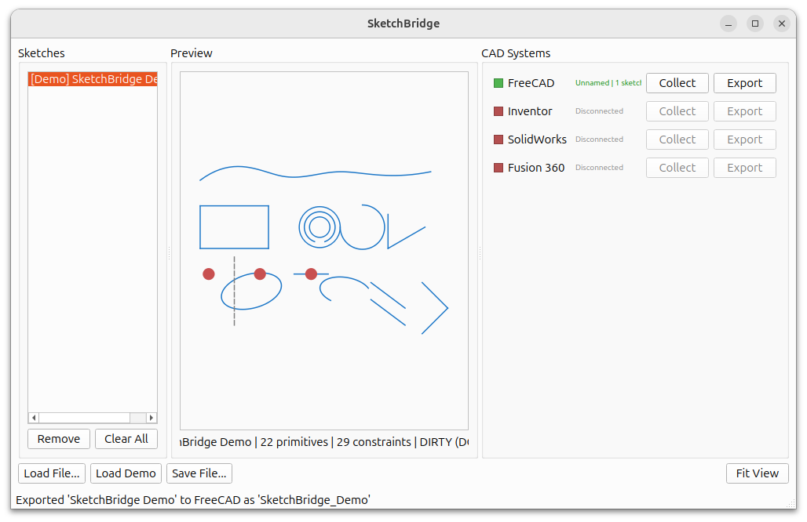
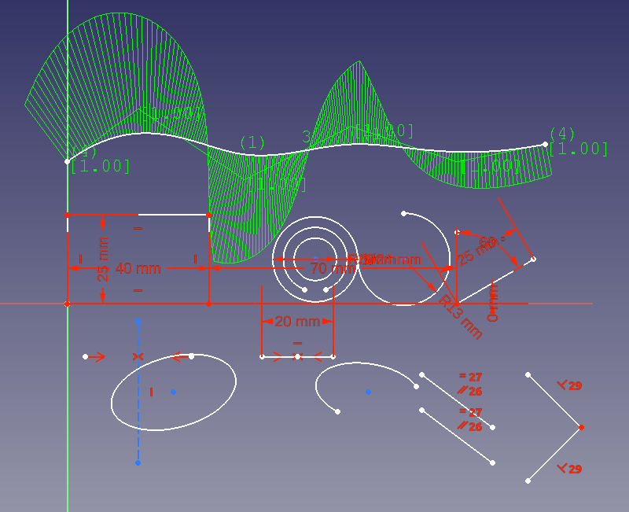

# SketchBridge

A desktop application for transferring 2D sketches between different CAD systems.

SketchBridge provides a unified interface for collecting sketches from one CAD application and exporting them to another, using [Morphe](https://github.com/CodeReclaimers/morphe) as an intermediate representation.




## Features

- **Multi-CAD Support**: Connect to FreeCAD, Autodesk Inventor, SolidWorks, and Fusion 360
- **Live Connection Monitoring**: Automatically detects when CAD systems are available
- **Sketch Preview**: Visual preview of sketches before export
- **Transform on Export**: Apply translation and rotation when exporting sketches
- **Plane Selection**: Choose the target plane (XY, XZ, YZ, or model faces) for sketch creation
- **File I/O**: Load and save sketches as JSON files

## Supported CAD Systems

| CAD System | Port | Adapter Package |
|------------|------|-----------------|
| FreeCAD | 9876 | `morphe.adapters.freecad` |
| Autodesk Inventor | 9877 | `morphe.adapters.inventor` |
| SolidWorks | 9878 | `morphe.adapters.solidworks` |
| Fusion 360 | 9879 | `morphe.adapters.fusion` |

## Installation

```bash
pip install sketch_bridge
```

Or install from source:

```bash
git clone https://github.com/CodeReclaimers/sketch_bridge.git
cd sketch_bridge
pip install -e .
```

### Dependencies

- Python 3.10+
- PySide6
- [morphe-sketch](https://pypi.org/project/morphe-sketch/) (Morphe sketch library)

## Usage

### Starting SketchBridge

```bash
sketch-bridge
```

Or run as a module:

```bash
python -m sketch_bridge
```

### Setting Up CAD Connections

Each CAD system requires its RPC server to be running. The server runs inside the CAD application and exposes sketch functionality over the network.

#### FreeCAD

In FreeCAD's Python console:

```python
from morphe.adapters.freecad.server import start_server
start_server()
```

#### Other CAD Systems

Similar setup is required for Inventor, SolidWorks, and Fusion 360. Refer to each adapter's documentation for specific instructions.

### Workflow

1. **Start SketchBridge** - The application will automatically detect running CAD servers
2. **Collect Sketches** - Click "Collect" on a connected CAD system to import all its sketches
3. **Preview** - Select a sketch to see it in the preview panel
4. **Export** - Click "Export" to send the selected sketch to another CAD system

### Export Options

When exporting a sketch, you can configure:

- **Target Plane**: XY, XZ, YZ, or a planar face from the model
- **Translation**: Offset the sketch by (dx, dy) in millimeters
- **Rotation**: Rotate the sketch by a specified angle (degrees)
- **Strip Constraints**: Remove geometric constraints (recommended when applying rotation)

> **Note**: When applying rotation, the "Strip constraints" option is automatically enabled. This prevents the CAD solver from distorting the transformed geometry by trying to satisfy constraints that may conflict with the rotation.

### File Operations

- **Load File**: Import a sketch from a JSON file
- **Save File**: Export the selected sketch to a JSON file

## Architecture

```
sketch_bridge/
├── app.py              # Application entry point
├── transform.py        # Sketch transformation utilities
├── cad/
│   ├── manager.py      # CAD connection manager
│   └── clients.py      # CAD client wrappers
└── ui/
    ├── main_window.py  # Main application window
    ├── sketch_list.py  # Sketch list widget
    ├── preview.py      # Sketch preview widget
    ├── cad_status.py   # CAD connection status widget
    └── export_dialog.py # Export options dialog
```

## Development

### Setup

```bash
git clone https://github.com/CodeReclaimers/sketch_bridge.git
cd sketch_bridge
pip install -e ".[dev]"
```

### Running Tests

```bash
pytest
```

### Code Style

This project uses [Ruff](https://github.com/astral-sh/ruff) for linting:

```bash
ruff check .
ruff format .
```

## Building Standalone Executables

SketchBridge can be packaged as a standalone Windows executable using PyInstaller. This allows users to run SketchBridge without installing Python.

### Prerequisites

- Python 3.10 or later
- All SketchBridge dependencies installed
- PyInstaller (installed automatically by the build script if missing)

### Building on Windows

Using PowerShell:

```powershell
.\build_windows.ps1
```

Or using Command Prompt:

```cmd
build_windows.bat
```

### Build Output

The build creates a folder-based distribution at:

```
dist/SketchBridge/
├── SketchBridge.exe    # Main executable
├── *.dll               # Required DLLs
└── ...                 # Other dependencies
```

To distribute SketchBridge, copy the entire `dist/SketchBridge` folder to the target machine.

### Build Configuration

The build is configured via `sketch_bridge.spec`. Key settings:

- **Hidden imports**: CAD adapter packages and PySide6 modules
- **Excludes**: Unnecessary packages (numpy, matplotlib, etc.) to reduce size
- **Console mode**: Disabled (windowed application)

To add a custom icon, edit `sketch_bridge.spec` and set the `icon` parameter:

```python
exe = EXE(
    ...
    icon='assets/icon.ico',  # Windows icon file
)
```

## Related Projects

- [Morphe](https://github.com/CodeReclaimers/morphe) - CAD-agnostic 2D sketch geometry and constraint representation with adapters for FreeCAD, Fusion 360, SolidWorks, and Inventor

## License

MIT License - see [LICENSE](LICENSE) for details.
